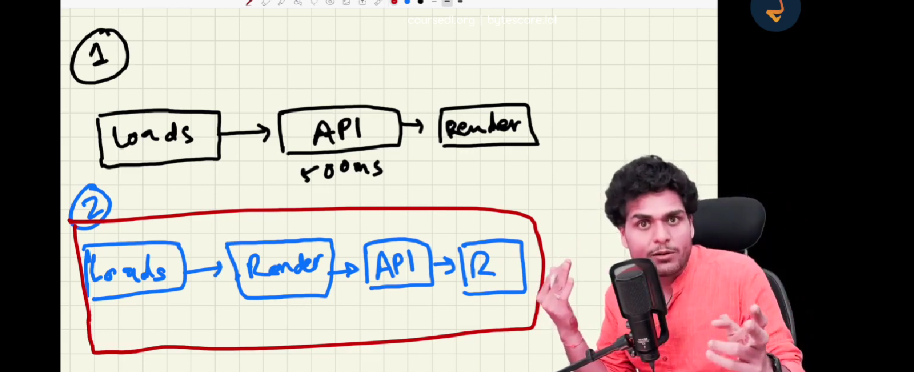

# learnings

# parcel

- dev builder 
- local server 
- file watching algorithm
- caching faster builds 
- bundler ,minfy the files, image optimization 
- compressing
- consistent hashing al cold splitting
- removes unused codes and error handling 
- new folder sare created dist and parcel-cache that contains dev buold or prduction build code
- 
- tree shaking removes unwanted mosules 

# app layout
 <!-- -applayout
    -header
      -logo
      -navitems
    -body
      -search
      -reastraunt-container
        -restraunt-cards
          -rating
          -timeof delivery
          -cuisine
    -footer
      -copyright
      -links -->

# react hooks
- normal js function utility functions
- usestate() -> it maintains the state of your component  ,scope of  a local state varaible is inside that component

- useeffect()

- state varaible
  inside this usstate we pass the defualt value that variable will recieve
  usestate is a hook which returns the array
  the setnewListRestraunt function is used to update the newlistRetraunt state variable it can be updated like a normal js vatriable
  let [newListRestraunt, setnewListRestyraunt] = useState(restaurantList);

